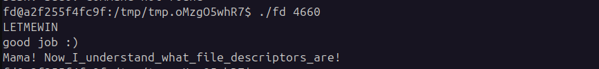

# 🛡️ Pwnable.kr - fd (Toddler's Bottle)


## 📌 Descripción del Reto
El reto **fd** introduce conceptos fundamentales de programación en C y el manejo de descriptores de archivos (*File Descriptors*) en sistemas operativos Linux. El objetivo es manipular la entrada del programa para cumplir con una validación lógica y obtener la flag.

---

Al comenzar nos encontramos con lo que parece ser 3 archivos principales, uno llamado `fd`, otro `fd.c` y otro que es la flag.

No tenemos permisos para ejecutar ni para hacer `cat` a la flag, por lo que hacemos `cat` a `fd.c`.

## 🔍 Análisis del Código Fuente

El código fuente proporcionado en el binario es el siguiente:

```c
#include <stdio.h>
#include <stdlib.h>
#include <string.h>
char buf[32];
int main(int argc, char* argv[], char* envp[]){
	if(argc<2){
		printf("pass argv[1] a number\n");
		return 0;
	}
	int fd = atoi( argv[1] ) - 0x1234;
	int len = 0;
	len = read(fd, buf, 32);
	if(!strcmp("LETMEWIN\n", buf)){
		printf("good job :)\n");
		setregid(getegid(), getegid());
		system("/bin/cat flag");
		exit(0);
	}
	printf("learn about Linux file IO\n");
	return 0;
}
```
Al ver el código en C por primera vez, tendremos que dividirlo, ver cómo funciona; esta es la base principal de la ingeniería inversa:
```c
Cif (argc < 2)
```
Aquí podemos ver que el programa nos pide un argumento. ¿Qué va a hacer con el argumento?
```c
int fd = atoi( argv[1] ) - 0x1234;
```
Al buscar en internet el significado de atoi, vemos que es una función que convierte de ASCII a Entero (ASCII to Integer), y a este resultado le resta 0x1234 (4660 en decimal). Este resultado lo guarda en la variable fd.
¿Para qué usa esa variable?
```c
len = read(fd, buf, 32);
```

Al ver esta línea de código podemos observar 3 cosas importantes:
1. Fijarnos en qué es la función read(). Al buscarlo, vemos que la función read() en C requiere 3 cosas: read(descriptor_de_archivo, donde_lo_guardo, cuantos_bytes).
2. El parámetro fd es la variable que desglosamos antes. Al buscar qué es el descriptor de archivos, vemos que tiene 3 valores principales: 0 = Entrada estándar (teclado), 1 = Salida estándar (pantalla), 2 = Error estándar.
3. Las demás variables ya están determinadas.

```c
if(!strcmp("LETMEWIN\n", buf))
```

y tambien:

```C
system("/bin/cat flag");
```

Esto significa que para que el programa imprima la flag, buf tiene que contener exactamente la palabra LETMEWIN\n.
¿Cómo se hace esto?
Pues anteriormente vimos que si fd vale 0, representa la entrada estándar del teclado. Por lo que para que read lea lo que yo escribo y lo guarde en buf, fd tiene que ser 0.

fd = tu número - 4660
0 = tu número - 4660  ==>  tu número = 4660

## 🚀 Explotación



Como podemos ver en la imagen, ingresamos el número 4660 tras ejecutarlo con ./fd y tenemos la flag:
```c
Mama! Now_I_understand_what_file_descriptors_are!
```
